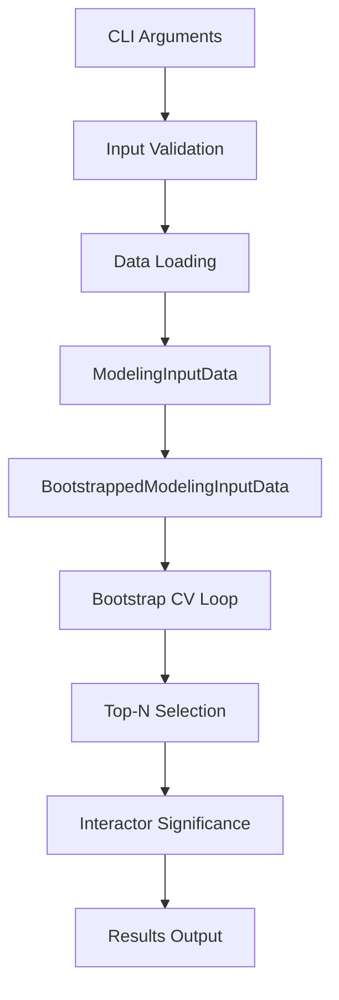

# interface

The main interface module provides the core workflow functions and command-line interface components for tfbpmodeling.

::: tfbpmodeling.interface

## Overview

The interface module serves as the primary entry point for the tfbpmodeling workflow. It contains:

- **Main workflow function**: `linear_perturbation_binding_modeling()`
- **CLI helper functions**: Argument parsing utilities for the command-line interface
- **Custom formatters**: Enhanced help formatting for better user experience

## Main Functions

### linear_perturbation_binding_modeling

The core function that executes the complete 4-stage TFBP modeling workflow:

1. **Data Preprocessing**: Load and validate input files, handle missing data
2. **Bootstrap Modeling**: All-data analysis with bootstrap resampling and LassoCV
3. **Top-N Modeling**: Refined analysis on significant predictors from top-performing data
4. **Interactor Significance**: Statistical evaluation of interaction terms vs main effects

**Parameters**: Command-line arguments object containing all configuration options

**Returns**: None (results saved to output directory)

**Key Features**:
- Comprehensive input validation
- Automatic output directory creation with timestamps
- Detailed logging of all processing steps
- Error handling with informative messages

### CLI Helper Functions

#### common_modeling_input_arguments
Adds standard input arguments to argument parsers:
- File paths for response and predictor data
- Perturbed TF specification
- Bootstrap and sampling parameters

#### common_modeling_feature_options
Configures feature engineering options:
- Polynomial terms (squared, cubic)
- Row maximum inclusion
- Custom variable additions and exclusions

#### common_modeling_binning_arguments
Sets up data stratification parameters:
- Bin edge specifications
- Stratification methods

#### add_general_arguments_to_subparsers
Propagates global arguments to subcommand parsers:
- Logging configuration
- System-wide options

## Data Flow



## Usage Examples

### Programmatic Usage

```python
import argparse
from tfbpmodeling.interface import linear_perturbation_binding_modeling

# Create arguments object
args = argparse.Namespace(
    response_file='data/expression.csv',
    predictors_file='data/binding.csv',
    perturbed_tf='YPD1',
    n_bootstraps=1000,
    top_n=600,
    all_data_ci_level=98.0,
    topn_ci_level=90.0,
    max_iter=10000,
    output_dir='./results',
    output_suffix='',
    n_cpus=4,
    # ... other parameters
)

# Run analysis
linear_perturbation_binding_modeling(args)
```

### Custom Argument Parser

```python
import argparse
from tfbpmodeling.interface import (
    common_modeling_input_arguments,
    common_modeling_feature_options,
    CustomHelpFormatter
)

# Create custom parser
parser = argparse.ArgumentParser(
    formatter_class=CustomHelpFormatter,
    description="Custom TFBP Analysis"
)

# Add standard arguments
input_group = parser.add_argument_group("Input")
common_modeling_input_arguments(input_group)

feature_group = parser.add_argument_group("Features")
common_modeling_feature_options(feature_group)

# Parse and use
args = parser.parse_args()
linear_perturbation_binding_modeling(args)
```

## Error Handling

The interface module includes comprehensive error handling:

### Input Validation Errors
```python
# File existence checks
FileNotFoundError: "File data/missing.csv does not exist."

# Parameter validation
ValueError: "The `max_iter` parameter must be a positive integer."

# Data format validation
ValueError: "Perturbed TF 'INVALID' not found in response file columns"
```

### Runtime Errors
```python
# Convergence issues
RuntimeWarning: "LassoCV failed to converge for 15/1000 bootstrap samples"

# Insufficient data
ValueError: "Insufficient data after filtering. Found 5 samples, minimum required: 10"
```

## Configuration Options

The interface supports extensive configuration through command-line arguments:

### Core Parameters
- **Input files**: Response data, predictor data, optional blacklist
- **TF specification**: Name of perturbed transcription factor
- **Bootstrap settings**: Sample count, random seed, weight normalization

### Feature Engineering
- **Polynomial terms**: Squared and cubic pTF terms
- **Additional predictors**: Row max, custom variables
- **Interaction control**: Variable exclusions, main effects

### Model Configuration
- **Confidence intervals**: Separate thresholds for each stage
- **Convergence**: Maximum iterations, dropout options
- **Performance**: CPU cores, memory management

### Output Control
- **Directory structure**: Base directory, custom suffixes
- **Logging**: Verbosity levels, file vs console output

## Performance Considerations

### Memory Management
- Bootstrap samples stored efficiently using sparse representations
- Automatic garbage collection between stages
- Memory usage monitoring and warnings

### Parallel Processing
- LassoCV uses specified CPU cores for cross-validation
- Bootstrap samples processed in batches
- I/O operations optimized for large datasets

### Runtime Optimization
- Early stopping for non-convergent models
- Adaptive batch sizing based on available memory
- Progress reporting for long-running analyses

## Related Modules

- **[modeling_input_data](modeling_input_data.md)**: Core data structures
- **[bootstrapped_input_data](bootstrapped_input_data.md)**: Bootstrap resampling
- **[bootstrap_model_results](bootstrap_model_results.md)**: Result aggregation
- **[evaluate_interactor_significance_lassocv](evaluate_interactor_significance_lassocv.md)**: LassoCV-based significance testing
- **[evaluate_interactor_significance_linear](evaluate_interactor_significance_linear.md)**: Linear regression-based significance testing