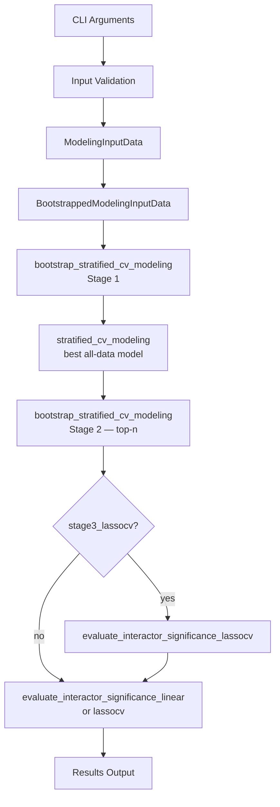

# __main__

The `__main__` module is the single entry point for the tfbpmodeling package. It contains
the CLI argument definitions, logging setup, and the complete modeling workflow.

::: tfbpmodeling.__main__

## Overview

The module contains:

- **`tfbpmodeling(args)`**: The main workflow function
- **`main()`**: CLI entry point — parses arguments and calls `tfbpmodeling(args)`
- **`configure_logging()`**: Sets up console or file logging
- **Parse helpers**: `parse_bins`, `parse_comma_separated_list`, `parse_json_dict`

## Main Workflow Function

### tfbpmodeling(args)

Executes the complete TFBP modeling workflow:

1. **Stage 0 — Preprocessing**: Load and validate input files
2. **Stage 1 — All Data Modeling**: Bootstrap LassoCV on the complete dataset; fit best all-data model on significant predictors
3. **Stage 2 — Top-N Modeling**: Bootstrap LassoCV on top-N data subset using Stage 1 significant predictors
4. **Stage 3 - LassoCV** *(optional)*: Refit surviving interactors with their main effects on all data
5. **Stage 3 - Lasso**: Test significance of each surviving interactor against its main effect

**Parameters**: `args` — `argparse.Namespace` containing all configuration options (see CLI reference)

**Returns**: None (results saved to output directory)

## Data Flow


```mermaid
graph TD
    A[CLI Arguments] --> B[Input Validation]
    B --> C[ModelingInputData]
    C --> D[BootstrappedModelingInputData]
    D --> E[bootstrap_stratified_cv_modeling\nStage 1]
    E --> F[stratified_cv_modeling\nbest all-data model]
    F --> G[bootstrap_stratified_cv_modeling\nStage 2 — top-n]
    G --> H{stage3_lassocv?}
    H -- yes --> I[evaluate_interactor_significance_lassocv]
    H -- no --> J[evaluate_interactor_significance_linear\nor lassocv]
    I --> J
    J --> K[Results Output]
```

## Programmatic Usage

```python
import argparse
from tfbpmodeling.__main__ import tfbpmodeling

args = argparse.Namespace(
    response_file='data/expression.csv',
    predictors_file='data/binding.csv',
    perturbed_tf='YPD1',
    n_bootstraps=1000,
    top_n=600,
    all_data_ci_level=98.0,
    topn_ci_level=90.0,
    max_iter=10000,
    output_dir='./results',
    output_suffix='',
    n_cpus=4,
    blacklist_file='',
    normalize_sample_weights=False,
    random_state=None,
    scale_by_std=False,
    bins=[0, 8, 64, float('inf')],
    row_max=False,
    squared_pTF=False,
    cubic_pTF=False,
    ptf_main_effect=False,
    exclude_model_variables=[],
    add_model_variables=[],
    iterative_dropout=False,
    stabilization_ci_start=50.0,
    stage3_lassocv=False,
    stage3_lasso=False,
    stage3_lasso_topn=False,
)

tfbpmodeling(args)
```

## Related Modules

- **[modeling_input_data](modeling_input_data.md)**: Core data structures
- **[bootstrapped_input_data](bootstrapped_input_data.md)**: Bootstrap resampling
- **[bootstrap_model_results](bootstrap_model_results.md)**: Result aggregation
- **[evaluate_interactor_significance_lassocv](evaluate_interactor_significance_lassocv.md)**: LassoCV-based significance testing
- **[evaluate_interactor_significance_linear](evaluate_interactor_significance_linear.md)**: Linear regression-based significance testing
