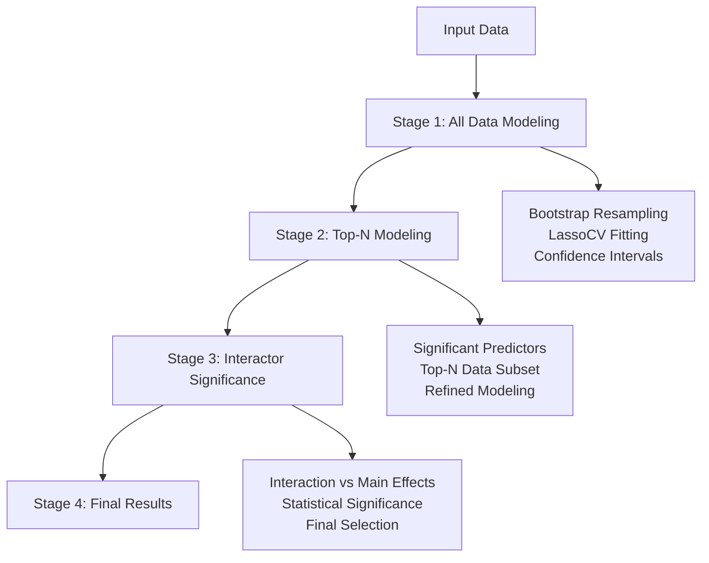

# tfbpmodeling

[](https://github.com/psf/black)
[](https://www.sphinx-doc.org/en/master/usage/index.html)
[](https://github.com/BrentLab/tfbpmodeling/actions/workflows/ci.yml)
[](https://codecov.io/gh/BrentLab/tfbpmodeling)

A Python package for **Transcription Factor Binding and Perturbation (TFBP) modeling** that analyzes relationships between transcription factor binding and gene expression perturbations using machine learning techniques.

## What is tfbpmodeling?

tfbpmodeling provides a comprehensive workflow for modeling the relationship between transcription factor binding data and gene expression perturbation data. The package uses bootstrap resampling and regularized regression (LassoCV) to identify significant binding-perturbation relationships while controlling for confounding factors.

### Key Features

- **Bootstrap Resampling**: Robust statistical inference through bootstrap confidence intervals
- **Regularized Regression**: LassoCV for feature selection and model fitting
- **Multi-stage Workflow**: Sequential modeling with increasing specificity
- **Interaction Analysis**: Statistical evaluation of interaction terms vs main effects
- **Flexible Input**: Support for various data formats and feature engineering options
- **Comprehensive Output**: Detailed results with confidence intervals and diagnostics

### Workflow Overview

The package implements a 4-stage sequential workflow:



1. **All Data Modeling**: Bootstrap resampling with LassoCV on complete dataset
2. **Top-N Modeling**: Secondary modeling on most significant predictors from top-performing data
3. **Interactor Significance**: Evaluation of interaction terms against main effects
4. **Results Generation**: Comprehensive output with confidence intervals and statistics

## Quick Start

### Installation

```bash
git clone https://github.com/BrentLab/tfbpmodeling.git
cd tfbpmodeling
poetry install
```

### Basic Usage

```bash
poetry run python -m tfbpmodeling linear_perturbation_binding_modeling \
    --response_file expression_data.csv \
    --predictors_file binding_data.csv \
    --perturbed_tf YourTF
```

## Documentation Structure

- **[Getting Started](getting-started/installation.md)**: Installation and setup instructions
- **[CLI Reference](cli/overview.md)**: Complete command-line interface documentation
- **[Tutorials](tutorials/basic-workflow.md)**: Step-by-step guides and examples
- **[API Reference](api/interface.md)**: Detailed API documentation for all modules
- **[Development](development/contributing.md)**: Contributing guidelines and development setup

## Use Cases

tfbpmodeling is designed for researchers working with:

- **Transcription Factor Studies**: Analyzing TF binding patterns and their effects on gene expression
- **Gene Expression Analysis**: Understanding perturbation effects in transcriptional networks
- **Regulatory Network Modeling**: Building predictive models of transcriptional regulation
- **Functional Genomics**: Integrating binding and expression data for biological insights

## Citation

If you use tfbpmodeling in your research, please cite:

```bibtex
@software{tfbpmodeling,
  title = {tfbpmodeling: Transcription Factor Binding and Perturbation Modeling},
  author = {Mateusiak, Chase and Eric Jia and Erdenebaatar, Zolboo and Mueller, Ben and Liu, Chenxing and Brent, Michael},
  url = {https://github.com/BrentLab/tfbpmodeling},
  year = {2024}
}
```

## Support

- **Issues**: Report bugs and request features on [GitHub Issues](https://github.com/BrentLab/tfbpmodeling/issues)
- **Discussions**: Ask questions on [GitHub Discussions](https://github.com/BrentLab/tfbpmodeling/discussions)
- **Documentation**: Browse the complete documentation at [https://brentlab.github.io/tfbpmodeling/](https://brentlab.github.io/tfbpmodeling/)